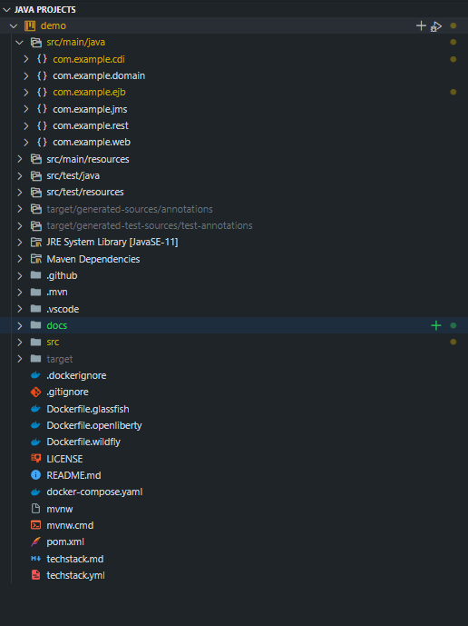
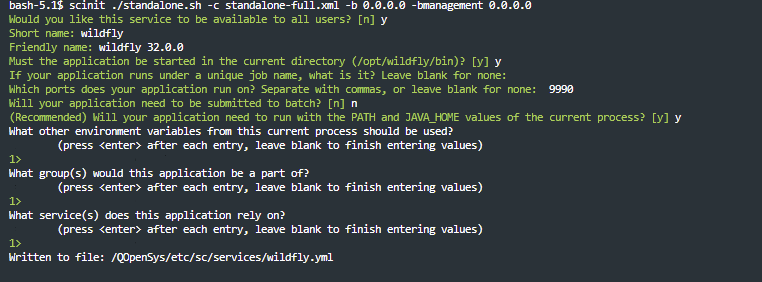
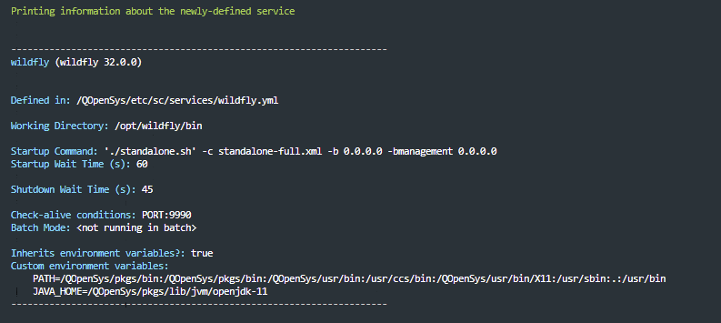

# Kickstart a Jakarta EE 10 Application on IBM i

This document contains instructions on how to build and deploy the Jakarta EE 10 boilerplate for IBM i. 

## Getting Started

Here is the build environment I recommend using:
- JDK 11
- Maven
- VSCode
- Git

### VSCode setup and dependencies

First install the Java developoment extensions☕:
- [Extension Pack for Java](https://marketplace.visualstudio.com/items?itemName=vscjava.vscode-java-pack)

## Clone the Project

In a terminal, clone a copy of this fork:

```bash
git clone https://github.com/ajshedivy/jakartaee10-ibmi-boilerplate.git
```

checkout the IBM i branch:

```bash
cd jakartaee10-ibmi-boilerplate/
git checkout deploy/ibmi
```
Open the `jakartaee10-ibmi-boilerplate` folder in a vscode window. Here is a view of the Java Project structure:


## Build and Run
For the IBM i integration, I will be using the WildFly application server. @hantsy has configured support for other application servers such as GlassFish and OpenLiberty in the [docs](https://hantsy.github.io/jakartaee10-starter-boilerplate/).

## Deploy WildFly on IBM i

Follow the instructions in this article to deploy a WildFly server on IBM i: [Deploying WildFly on IBM i](https://ibmi-oss-docs.readthedocs.io/en/latest/java/wildfly/DEPLOYMENT.html#step-5-configure-server-address-optional)

### Manage Deployment with Service Commander (recommended)

I highly recommend this step to easily manage your WildFly deployment. There are a couple small changes to the `sc` configuration for this demo that I will highlight here.

- Install the `servive-commander` package:
```bash
yum install service-commander
```

- `cd` to wildFly installation directory:
```bash
cd $WILDFLY/bin
```
- Run the scinit command to create a service definition for the standalone.sh command. Proceed to answer the questions as in the following screenshot

```bash
scinit ./standalone.sh -c standalone-full.xml -b 0.0.0.0 -bmanagement 0.0.0.0
```


**Note**: For the boilerplate demo to work, we need to use the full standalone profile `-c standalone-full.xml` that supports a Jakarta EE Full Server profile with extended capabilities. 




now you can use the `sc` command to start the service:

```bash
sc start wildfly
```

### Deploy Boilerplate using maven plugin

The project is current configured to use the maven wildfly plugin:
```xml
<plugin>
    <groupId>org.wildfly.plugins</groupId>
    <artifactId>wildfly-maven-plugin</artifactId>
    <version>${wildfly-maven-plugin.version}</version>
</plugin>
```

To deploy to the WildFly server on IBM i, configure `hostname`, `port`, and the admin account you set up in [Deploying WildFly on IBM i](https://ibmi-oss-docs.readthedocs.io/en/latest/java/wildfly/DEPLOYMENT.html#step-5-configure-server-address-optional)

```xml

<configuration>
    <!-- To deploy a running wildfly server -->
    <hostname>HOST</hostname>
    <port>9990</port>
    <username>admin</username>

    <!--add the password set for admin during setup -->
    <password>theadminpw123</password> 
    
    ...

</configuration>
```


Use the following command to deploy and undeploy the application:
```bash
# deploy applications
mvn clean package -Pwildfly wildfly:deploy

# undeploy 
mvn -Pwildfly wildfly:undeploy

```

## Usage
forthcoming ...


